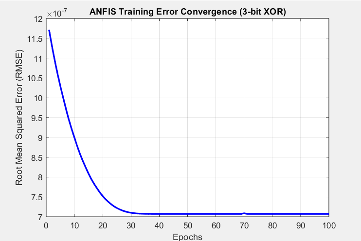
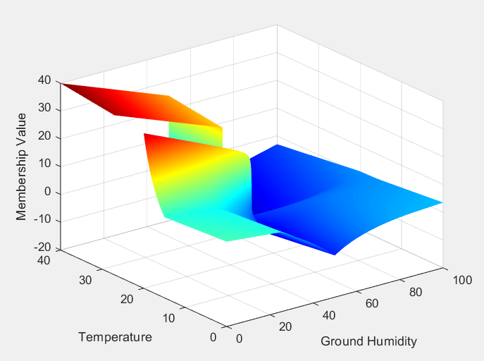

# Hybrid & Intelligent Systems - MATLAB Portfolio

This repository features advanced MATLAB implementations of hybrid intelligent systems, optimization algorithms, and machine learning models developed during my studies in Biomedical Engineering (UNIWA). It bridges classical fuzzy logic with data-driven neural networks and metaheuristic optimization techniques.

## Repository Overview

### 1. Neural Networks & Custom Optimizers
* **`adam_and_anfis_xor.m`**: Implements the **Adam Optimizer** (Adaptive Moment Estimation) *from scratch* for neural network training, incorporating first/second moment tracking and bias correction formulas.

### 2. Neuro-Fuzzy Systems (ANFIS)
* **`adam_and_anfis_xor.m` (Part 2)**: Solves the non-linear **3-bit XOR problem** using an **Adaptive Neuro-Fuzzy Inference System (ANFIS)**. Utilizes grid partitioning (`genfis`) with Gaussian membership functions and zero-order Sugeno models, showcasing rapid RMSE error convergence over training epochs.

### 3. Regression, Regularization & Advanced Optimization
* **`boston_regression_optimization.m`**: A comprehensive script built on the Boston Housing dataset, covering:
  * **Polynomial Regression & Ridge Regularization (L2)** to prevent overfitting.
  * **Gradient Descent, Adam, and Mini-Batch** optimization routines implemented using MATLAB's `dlarray` and `dlfeval` automatic differentiation framework.
  * **Global Optimization Metaheuristics**: Training regression parameters using **Genetic Algorithms (`ga`)** και **Simulated Annealing (`simulannealbnd`)**.

### 4. Fuzzy Control Systems (Mamdani & Sugeno TSK)
* **`hybrid_fuzzy_sugeno_controller.m`**: Complete multi-rule Mamdani fuzzy controller for lighting systems and a **Sugeno-type (TSK) controller** for multi-variable environmental control (Ground Humidity vs. Temperature). Generates 3D control surfaces (`surf`) and evaluates performance across specific operational scenarios.

## Acknowledgments & Context
The foundational concepts, algorithms, and initial MATLAB scripts for these projects were developed as part of my undergraduate coursework at the **University of West Attica (Biomedical Engineering)**. 

The current repository represents a curated, cleaned, and well-documented collection of those assignments. The code has been organized to serve as a clear, accessible reference and tutorial for computational intelligence and fuzzy logic applications using MATLAB.

---
*Curated and documented by a final-year Biomedical Engineering student (University of West Attica), specializing in AI and Medical Data Science.*
